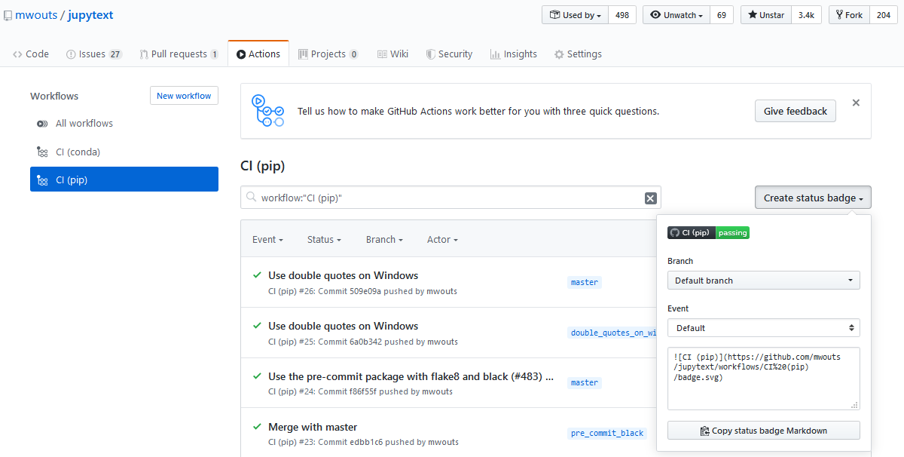
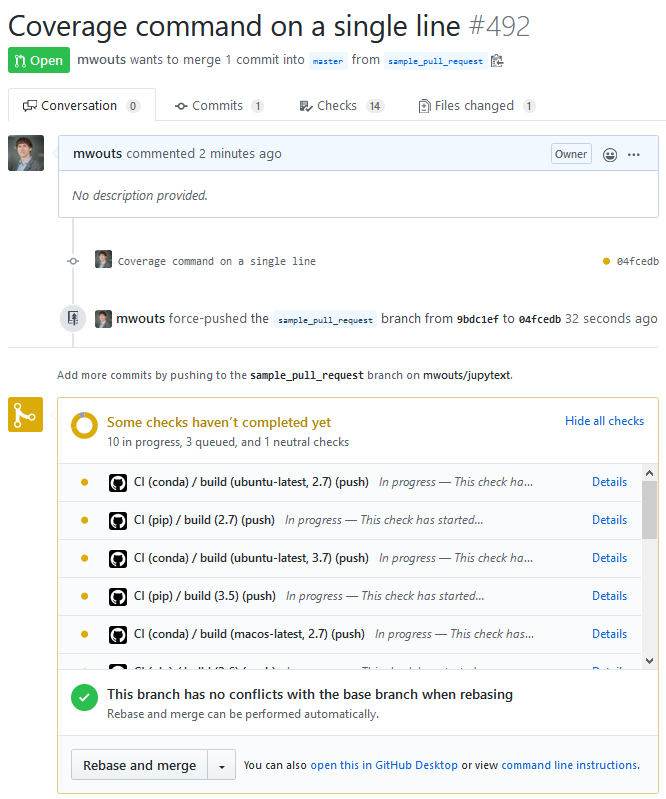
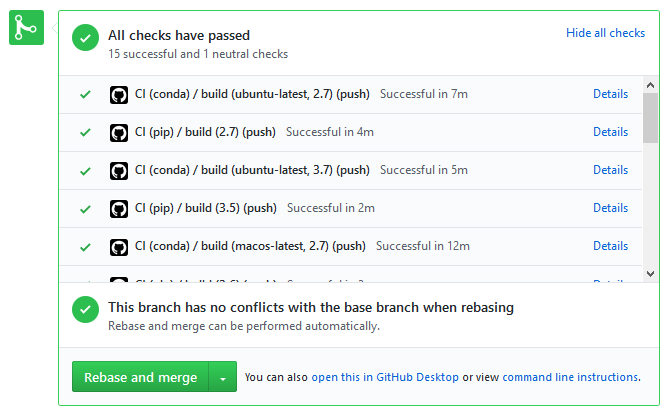
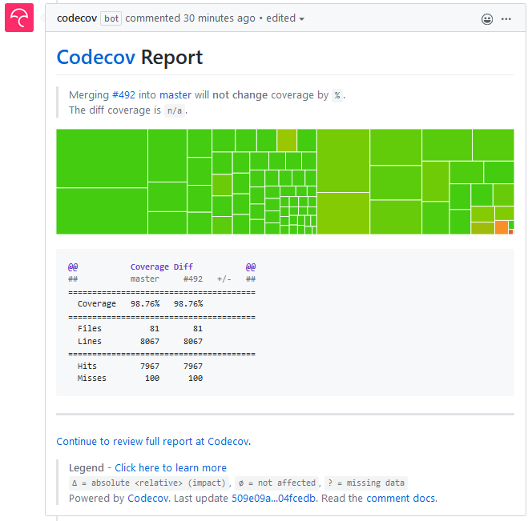
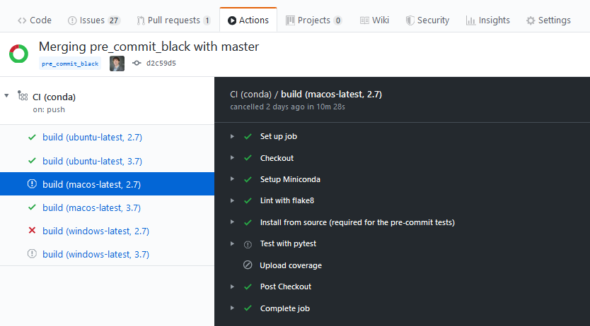

# Testing your Python Project with GitHub Actions

A few days ago I used GitHub Actions on a project of mine for the first time.
Overall the outcome was very positive, but there was also some work involved.
Hopefully, this post can help you do the same at a lower cost!

## Activating GitHub Actions

Create a `.github/workflows` directory at the root of your project:
```bash
mkdir -p .github/workflows
```
and, in that directory, create one or more YAML file with the name of your choice.

In my case I created two files: 
- [`continuous-integration-pip.yml`](https://github.com/mwouts/jupytext/blob/master/.github/workflows/continuous-integration-pip.yml), and
- [`continuous-integration-conda.yml`](https://github.com/mwouts/jupytext/blob/master/.github/workflows/continuous-integration-conda.yml).

## Naming your actions

At the top of the YAML file, we have this field: `name: CI (pip)`. While the name of the YAML file does not seem to have any impact, the `name` field at the top of the file is the one that appears in your [Actions tab](https://github.com/mwouts/jupytext/actions), and also the name that you will see on your badge:



## Trigger on push or pull_request events?

With the `on` field, you choose which events should trigger an action. I initially tried `on: [push, pull_request]`, but I soon had the feeling that too many builds were triggered. Now I use `on: [push]` and that seems to be enough. With this, contributors receive an email when one of their commits breaks the CI, so they can fix the issue before opening a pull request. And with `on: [push]` already, you get status updates in the pull request:



And, a few minutes later:



## Testing multiple variants of Python

Python code is portable, but in practice, I prefer to test my code on various platforms.

In my project, I want to test
- Python environments build with both `pip` and `conda`
- Python versions 2.7, 3.5, 3.6, 3.7 and 3.8
- Python on Linux, Mac OS or Windows.

Note that I don't need to test the full matrix (30 jobs). If I test all the Python versions with pip and Linux, and Python 2.7 and 3.7 with conda on all the possible OS (11 jobs), then I can already be confident that my program is going to work almost everywhere.

Let's start with `pip`, which is super easy to set up. Here is an extract of my [`continuous-integration-pip.yml`](https://github.com/mwouts/jupytext/blob/master/.github/workflows/continuous-integration-pip.yml) file, that shows:
- how to check out the GitHub repository with `actions/checkout@v2`
- how to install Python with `actions/setup-python@v1`, in a version parametrized by `python-version: ${{ matrix.python-version }}`
- how to install packages from the project's `requirements.txt` and `requirements-dev.txt` files
- how to install optional dependencies
```
name: CI (pip)
on: [push]

jobs:
  build:
    strategy:
      matrix:
        python-version: [2.7, 3.5, 3.6, 3.7, 3.8]
    runs-on: ubuntu-latest
    steps:
      - name: Checkout
        uses: actions/checkout@v2
      - name: Set up Python ${{ matrix.python-version }}
        uses: actions/setup-python@v1
        with:
          python-version: ${{ matrix.python-version }}
      - name: Install dependencies
        run: |
          python -m pip install --upgrade pip
          pip install -r requirements.txt
          pip install -r requirements-dev.txt
          # install black if available (Python 3.6 and above)
          pip install black || true
```

Now we head on to `conda`. This extract of my [`continuous-integration-conda.yml`](https://github.com/mwouts/jupytext/blob/master/.github/workflows/continuous-integration-conda.yml) file shows:
- how to check out your GitHub repository with `actions/checkout@v2`
- how to choose the OS among Ubuntu (Linux), Mac OS, Windows
- how to install Miniconda with `goanpeca/setup-miniconda@v1`, with a version of Python parametrized by `python-version: ${{ matrix.python-version }}`
- how to create the conda environment from the [`environment.yml` file](https://github.com/mwouts/jupytext/blob/master/environment.yml)
- and how to activate the corresponding environment
```
name: CI (conda)
on: [push]

jobs:
  build:
    strategy:
      matrix:
        os: ['ubuntu-latest', 'macos-latest', 'windows-latest']
        python-version: [2.7, 3.7]
    runs-on: ${{ matrix.os }}
    steps:
      - name: Checkout
        uses: actions/checkout@v2
      - name: Setup Miniconda
        uses: goanpeca/setup-miniconda@v1
        with:
          auto-update-conda: true
          auto-activate-base: false
          miniconda-version: 'latest'
          python-version: ${{ matrix.python-version }}
          environment-file: environment.yml
          activate-environment: jupytext-dev
```

## Code quality

Before running any test, it is a good idea to make sure that all the code is valid, which I do with `flake8`.

The corresponding step in my [`continuous-integration-pip.yml`](https://github.com/mwouts/jupytext/blob/master/.github/workflows/continuous-integration-pip.yml) file is 
```
      - name: Lint with flake8
        run: |
          # stop the build if there are Python syntax errors or undefined names
          flake8 . --count --select=E9,F63,F7,F82 --show-source --statistics
          # all Python files should follow PEP8 (except some notebooks, see setup.cfg)
          flake8 jupytext tests
          # exit-zero treats all errors as warnings.  The GitHub editor is 127 chars wide
          flake8 . --count --exit-zero --max-complexity=10 --statistics
```
In the [`continuous-integration-conda.yml`](https://github.com/mwouts/jupytext/blob/master/.github/workflows/continuous-integration-conda.yml), an additional `shell` parameter was required. I first tried `shell: pwsh` (PowerShell), and it worked, so I am now using
```
      - name: Lint with flake8
        shell: pwsh
        run: |
          # stop the build if there are Python syntax errors or undefined names
          flake8 . --count --select=E9,F63,F7,F82 --show-source --statistics
          # all Python files should follow PEP8 (except some notebooks, see setup.cfg)
          flake8 jupytext tests
          # exit-zero treats all errors as warnings.  The GitHub editor is 127 chars wide
          flake8 . --count --exit-zero --max-complexity=10 --statistics
```

## Understanding CI errors

I had initially an issue with the `flake8` step. The error was:
```
Lint with flake8
4s
##[error]Process completed with exit code 2.
Run # stop the build if there are Python syntax errors or undefined names
  # stop the build if there are Python syntax errors or undefined names
  flake8 . --count --select=E9,F63,F7,F82 --show-source --statistics
  all Python files should follow PEP8 (except some notebooks, see setup.cfg)
  flake8 jupytext tests
  # exit-zero treats all errors as warnings.  The GitHub editor is 127 chars wide
  flake8 . --count --exit-zero --max-complexity=10 --statistics
  shell: /bin/bash -e {0}
  env:
    pythonLocation: /opt/hostedtoolcache/Python/3.6.10/x64
0
/home/runner/work/_temp/98d1db20-f0af-4eba-af95-cb39421c77b0.sh: line 3: syntax error near unexpected token `('
##[error]Process completed with exit code 2.
```
My understanding is that `/home/runner/work/_temp/98d1db20-f0af-4eba-af95-cb39421c77b0.sh` is a temporary script that contains the commands for that step.
So when we are told that the script throws this error: _line 3: syntax error near unexpected token \`('_, we should look at the third line of the `run`
property of that step. In my command, that was _all Python files should follow PEP8 (except some notebooks, see setup.cfg)_, and indeed it was missing a 
comment char!

## Running Pytest

Once we are positive that the code is syntactically correct, we want to know whether all the unit tests pass. The corresponding step is:
```
      - name: Test with pytest
        run: coverage run --source=. -m py.test
```

Note that I use `coverage run --source=. -m py.test` and not just `pytest` because I also want to know the code coverage. Also, for the conda file, we need to add a `shell: pwsh` property, otherwise, the `coverage` or `pytest` command is not found.

## Uploading coverage

It's good to have the coverage computed in the CI, but it is even better to have a coverage update on pull requests, and a coverage badge in the README. For this, I use [codecov](https://codecov.io/). I prefer to upload the coverage only for the conda CI as it lets me test a larger fraction of the optional features. The coverage upload step is the last one in [`continuous-integration-conda.yml`](https://github.com/mwouts/jupytext/blob/master/.github/workflows/continuous-integration-conda.yml):
```
      - name: Upload coverage
        shell: pwsh
        run: coverage report -m
```

With this, I get a coverage badge  which I can add to my [README](https://github.com/mwouts/jupytext/blob/master/README.md), detailed coverage statistics and charts at [codecov.io](https://codecov.io/gh/mwouts/jupytext/branch/master), as well as coverage reports in pull requests:



## Automated job cancellation

One feature that surprised me at first, but makes sense, is the automated job cancellation. When one job in the CI fails, all the other jobs that are still running or pending are canceled. 

Here is an example of this on my project - a problem occurs with the Windows build, and that triggers the cancellation of the remaining Windows and Mac OS jobs:



## Differences with Travis-CI

Before discovering GitHub Actions, I was using [Travis-CI](travis-ci.com/). And I loved it! I have used Travis-CI on many projects, including this [fancy one](https://github.com/CFMTech/jupytext_papermill_post) where we [test... the README itself](https://github.com/CFMTech/jupytext_papermill_post/blob/master/.travis.yml)!

Now I will conclude with a brief comparison between the two.
- Travis-CI has been there for a much longer period. I could have feared that documentation would be harder to find for GitHub Actions, but that was not the case. Useful references were: [Using Python with GitHub Actions](https://help.github.com/en/actions/language-and-framework-guides/using-python-with-github-actions) and [Setup Miniconda](https://github.com/marketplace/actions/setup-miniconda).
- Just like Travis-CI, Github Actions is free to use for public projects.
- GitHub integration is excellent for both Travis-CI and GitHub Actions, although the Actions have a dedicated tab on the project page, which makes it even easier to access the CI.
- Configuring conda with Github Actions turned out to be simpler than with Travis-CI, for which I was using [this hack](https://github.com/mwouts/jupytext/blob/509e09ab6e0b72afe56f2cf4cbe0526e3ab981c4/.travis.yml#L17-L36).
- I found the Matrix (e.g. Python version times OS like [here](https://github.com/mwouts/jupytext/blob/master/.github/workflows/continuous-integration-conda.yml)) simpler to use on Github Actions.
- I have not noticed a significant difference in the duration of the jobs. On my sample PR, the six jobs (pip and conda, Linux only) on Travis-CI ran in [8m 33s](https://travis-ci.com/github/mwouts/jupytext/builds/160045470), while on GitHub Actions, the first series of five pip jobs (Linux only) ran in [4m 57s](https://github.com/mwouts/jupytext/actions/runs/77140156), while the other series of six conda jobs (Linux, Mac OS, Windows) ran in parallel in [12m 48s](https://github.com/mwouts/jupytext/actions/runs/77140151) - so, in that example, GitHub Actions took 50% longer, but also covered a larger number of configurations (+80%).

Thanks for reading this! If you want to read more, have a look at my other posts on [Medium](https://medium.com/@marc.wouts), at my open source projects on [GitHub](https://github.com/mwouts/), or follow me on [Twitter](https://twitter.com/marcwouts). Also, if you have experience with GitHub Actions in other contexts, if you know e.g. how to publish documentation online, please let us know with a comment here, or feel free to open an issue or make a pull request on this [repo](https://github.com/mwouts/github_actions_python)!